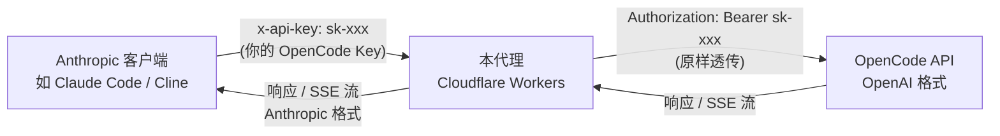

# OpenCode Anthropic Proxy

将 **OpenAI 兼容 API** 反向代理为 **Anthropic Messages API 格式**。

默认配置指向 OpenCode Go 套餐的 DeepSeek V4 Flash，但你可以通过环境变量接入任何 OpenAI 兼容的 API。

让你可以在任何支持 Anthropic API 的客户端（如 Claude Code、Cline、Continue 等）中，使用非 Anthropic 的模型。

## 工作原理



**关键设计：API Key 透传。** 客户端请求中携带的 `x-api-key` 或 `Authorization` 头会被直接转发到 OpenCode API，不在 Worker 中存储任何密钥。

### 请求转换（Anthropic → OpenAI）

| Anthropic | OpenAI |
|---|---|
| `system` 参数 | `messages[0].role = "system"` |
| `messages[].content`（字符串或数组） | 提取纯文本 |
| 任意模型名 | 统一映射为 `TARGET_MODEL`（默认 `deepseek-v4-flash`） |
| `stop_sequences` | `stop` |
| `stream: true/false` | 透传 |

### 响应转换（OpenAI → Anthropic）

| OpenAI | Anthropic |
|---|---|
| `choices[0].message.reasoning_content` | `content[0]: {type: "thinking", thinking: "..."}` |
| `choices[0].message.content` | `content[1]: {type: "text", text: "..."}` |
| `finish_reason: "stop"` | `stop_reason: "end_turn"` |
| `finish_reason: "length"` | `stop_reason: "max_tokens"` |
| `usage.prompt_tokens` / `completion_tokens` | `usage.input_tokens` / `output_tokens` |

思考和输出分别映射为 Anthropic 的 `thinking` 和 `text` 内容块，客户端可以分开展示。

### 流式 SSE 转换

```
OpenAI:  data: {"choices":[{"delta":{"reasoning_content":"..."}}]}
Anthropic: data: {"type":"content_block_delta","index":0,"delta":{"type":"thinking_delta","thinking":"..."}}

OpenAI:  data: {"choices":[{"delta":{"content":"..."}}]}
Anthropic: data: {"type":"content_block_delta","index":1,"delta":{"type":"text_delta","text":"..."}}
```

自动生成 `message_start`、`content_block_start/stop`、`message_delta/stop` 等完整事件序列。

## 部署

### 前置要求

- [Node.js](https://nodejs.org/) >= 18
- [Wrangler CLI](https://developers.cloudflare.com/workers/wrangler/)（`npm install -g wrangler`）
- Cloudflare 账号
- OpenCode Go 套餐 API Key

### 快速部署

```bash
# 1. 安装依赖
npm install

# 2. 部署
npm run deploy

# 3. 查看部署 URL
# 输出类似: https://opencode-anthropic-proxy.xxx.workers.dev
```

> 无需配置任何环境变量，API Key 由客户端透传。

### Cloudflare Dashboard 构建配置

如果使用 Cloudflare Workers Dashboard 的 Git 集成自动部署，按以下配置：

| 字段 | 值 |
|------|-----|
| 构建命令 | `pnpm build` |
| 部署命令 | 留空 |
| 根目录 | `/` |

### 可选环境变量

在 `wrangler.toml` 的 `[vars]` 中设置，或通过 Cloudflare Dashboard 配置：

| 变量 | 默认值 | 说明 |
|------|--------|------|
| `OPENCODE_BASE_URL` | `https://opencode.ai/zen/go/v1` | OpenCode Go 套餐 API 地址 |
| `TARGET_MODEL` | `deepseek-v4-flash` | 实际调用的模型名 |
| `ALLOWED_MODELS` | 全部允许 | 限制客户端可用的模型名（逗号分隔） |

### 本地开发

```bash
npm run dev
```

## API 端点

| 方法 | 路径 | 说明 |
|------|------|------|
| `GET` | `/health` | 健康检查 |
| `GET` | `/v1/models` | 列出可用模型 |
| `POST` | `/v1/messages` | 聊天补全（支持流式） |

## 使用

将客户端的 Anthropic API Base URL 指向你的 Worker 地址，**API Key 填写你的 OpenCode API Key**。

### curl 示例

**非流式：**

```bash
curl https://your-worker.xxx.workers.dev/v1/messages \
  -H "Content-Type: application/json" \
  -H "x-api-key: 你的 OpenCode API Key" \
  -H "anthropic-version: 2023-06-01" \
  -d '{
    "model": "deepseek-v4-flash",
    "max_tokens": 1024,
    "messages": [
      {"role": "user", "content": "你好"}
    ]
  }'
```

**流式：**

```bash
curl https://your-worker.xxx.workers.dev/v1/messages \
  -H "Content-Type: application/json" \
  -H "x-api-key: 你的 OpenCode API Key" \
  -H "anthropic-version: 2023-06-01" \
  -d '{
    "model": "deepseek-v4-flash",
    "max_tokens": 1024,
    "stream": true,
    "messages": [
      {"role": "user", "content": "讲个笑话"}
    ]
  }'
```

**查看可用模型：**

```bash
curl https://your-worker.xxx.workers.dev/v1/models
```

### 在 Claude Code / Cline / Continue 中使用

| 配置项 | 值 |
|--------|-----|
| API Base URL | `https://your-worker.xxx.workers.dev` |
| API Key | **你的 OpenCode API Key** |
| 模型名 | `deepseek-v4-flash`（或任意值，会被映射） |

## 健康检查

```bash
curl https://your-worker.xxx.workers.dev/health
# {"status":"ok","service":"opencode-anthropic-proxy"}
```

## 项目结构

```
opencode-anthropic-proxy/
├── src/
│   └── index.ts          # Worker 核心逻辑（路由、转换、流式处理）
├── wrangler.toml          # Cloudflare Workers 配置
├── package.json           # 依赖与脚本
├── tsconfig.json          # TypeScript 配置
├── .env.example           # 环境变量示例
└── README.md
```

## 技术栈

- **Runtime:** Cloudflare Workers（ES Modules）
- **语言:** TypeScript
- **客户端:** Wrangler CLI

## 许可证

MIT
