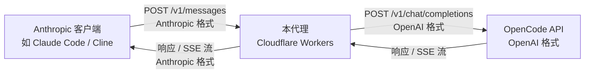

# OpenCode Anthropic Proxy

将 **OpenCode Go 套餐** 的 DeepSeek V4 Flash API 反向代理为 **Anthropic Messages API 格式**。

让你可以在任何支持 Anthropic API 的客户端（如 Claude Code、Continue.dev、Cline 等）中，直接使用 OpenCode Go 套餐的 DeepSeek V4 Flash 模型。

## 工作原理



**请求转换：**
- `system` 参数 → `messages[0].role = "system"`
- `messages[].content`（字符串或数组）→ 提取纯文本
- 任意 Anthropic 模型名 → 统一映射为 `deepseek-v4-flash`
- `stop_sequences` → `stop`

**响应转换：**
- OpenAI `choices[0].message.content` → Anthropic `content[0].text`
- `finish_reason: "stop"` → `stop_reason: "end_turn"`
- `finish_reason: "length"` → `stop_reason: "max_tokens"`
- `usage.prompt_tokens` → `usage.input_tokens`
- `usage.completion_tokens` → `usage.output_tokens`

**流式转换（SSE）：**
- OpenAI `data: {"choices":[{"delta":{"content":"..."}}]}` → Anthropic `data: {"type":"content_block_delta","delta":{"type":"text_delta","text":"..."}}`
- 自动生成 `message_start`、`content_block_start/stop`、`message_delta/stop` 事件

## 部署

### 前置要求

- [Node.js](https://nodejs.org/) >= 18
- [Wrangler CLI](https://developers.cloudflare.com/workers/wrangler/)（`npm install -g wrangler`）
- Cloudflare 账号
- OpenCode Go 套餐 API Key

### 快速部署

```bash
# 1. 安装依赖
npm install

# 2. 配置 OpenCode API Key（敏感信息，用 secret 设置）
wrangler secret put OPENCODE_API_KEY
# 然后输入你的 OpenCode API Key

# 3. 可选：配置其他环境变量
# wrangler secret put OPENCODE_BASE_URL  # 默认 https://api.opencode.ai/v1

# 4. 部署
npm run deploy

# 5. 查看部署 URL
# 输出类似: https://opencode-anthropic-proxy.xxx.workers.dev
```

### 环境变量

| 变量 | 必填 | 默认值 | 说明 |
|------|------|--------|------|
| `OPENCODE_API_KEY` | ✅ | — | OpenCode API 密钥 |
| `OPENCODE_BASE_URL` | ❌ | `https://api.opencode.ai/v1` | OpenCode API 基础地址 |
| `TARGET_MODEL` | ❌ | `deepseek-v4-flash` | 实际调用的模型名称 |
| `ALLOWED_MODELS` | ❌ | 全部允许 | 允许的 Anthropic 模型名列表（逗号分隔） |
| `ANTHROPIC_VERSION` | ❌ | `2023-06-01` | Anthropic API 版本头 |

### 本地开发

```bash
# 启动本地开发服务器（默认 http://localhost:8787）
npm run dev
```

## 使用

部署后，将客户端的 Anthropic API Base URL 指向你的 Worker 地址，并使用任意 API Key（本代理不校验 API Key，但需要传一个值）。

### curl 示例

**非流式请求：**

```bash
curl https://your-worker.xxx.workers.dev/v1/messages \
  -H "Content-Type: application/json" \
  -H "x-api-key: sk-not-used" \
  -H "anthropic-version: 2023-06-01" \
  -d '{
    "model": "claude-sonnet-4-20250514",
    "max_tokens": 1024,
    "messages": [
      {"role": "user", "content": "你好，请用中文回答：1+1=?"}
    ]
  }'
```

**流式请求：**

```bash
curl https://your-worker.xxx.workers.dev/v1/messages \
  -H "Content-Type: application/json" \
  -H "x-api-key: sk-not-used" \
  -H "anthropic-version: 2023-06-01" \
  -d '{
    "model": "claude-sonnet-4-20250514",
    "max_tokens": 1024,
    "stream": true,
    "messages": [
      {"role": "user", "content": "讲个笑话"}
    ]
  }'
```

### 在 Cursor/Claude Code/Cline 中使用

将 Anthropic API Base URL 配置为：

```
https://your-worker.xxx.workers.dev
```

API Key 随意填写（例如 `sk-not-used`），模型名填写任意支持的 Anthropic 模型名（如 `claude-sonnet-4-20250514`）。

> **注意**：当前已经配置了 `ALLOWED_MODELS` 时，请使用列表中的模型名。

## 健康检查

```bash
curl https://your-worker.xxx.workers.dev/health
# 返回: {"status":"ok","service":"opencode-anthropic-proxy"}
```

## 项目结构

```
opencode-anthropic-proxy/
├── src/
│   └── index.ts          # Worker 核心逻辑（路由、转换、流式处理）
├── wrangler.toml          # Cloudflare Workers 配置
├── package.json           # 依赖与脚本
├── tsconfig.json          # TypeScript 配置
├── .env.example           # 环境变量示例
└── README.md
```

## 技术栈

- **Runtime:** Cloudflare Workers（ES Modules）
- **语言:** TypeScript
- **部署:** Wrangler CLI

## 许可证

MIT
